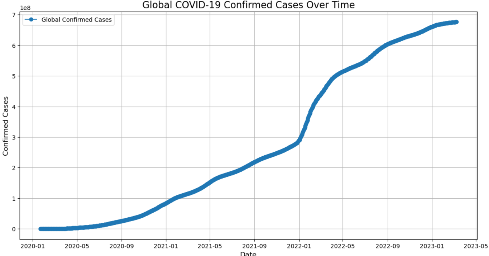
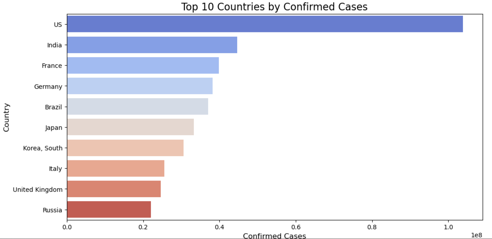
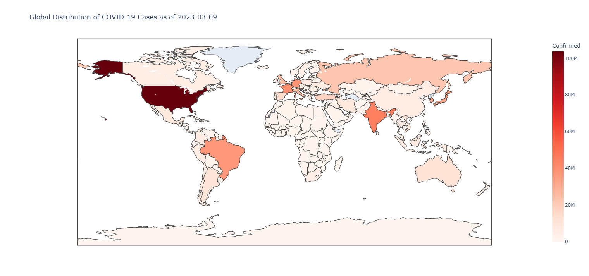
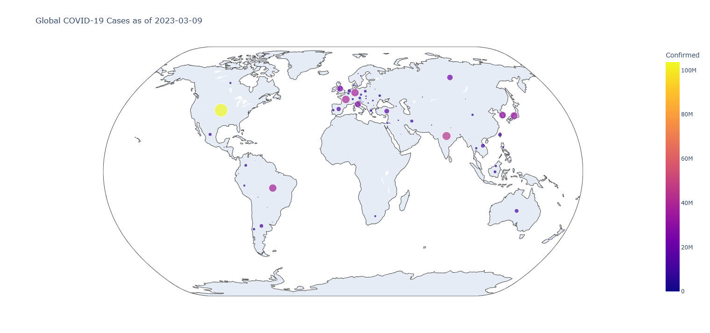

# COVID-19 Data Analysis and Visualization

## Overview  
This project is a Python-based system designed to analyze and visualize COVID-19 data. Using advanced libraries like Pandas, Matplotlib, Seaborn, and Plotly, the system provides detailed insights into the pandemic's trends, including global confirmed cases, country-specific analysis, and interactive maps.  

---

## Features  
- **Global Trends**: Analyze the overall progression of COVID-19 cases worldwide.  
- **Top 10 Affected Countries**: Visualize the most impacted nations using bar charts.  
- **Interactive World Maps**: Choropleth and scatter geo maps showcasing the global distribution of cases.  
- **Daily Case Analysis**: Insights into the daily increase in confirmed cases globally.  
- **Country-Specific Trends**: Drill down into trends for individual countries.  

---

## Visualizations  
- Line plots for global trends.  
- Bar charts for country comparisons.  
- Interactive maps for geographic distribution.  

---

## Prerequisites  
Ensure the following Python libraries are installed in your environment:  
- `pandas`  
- `numpy`  
- `matplotlib`  
- `seaborn`  
- `plotly`  
- `ipywidgets`  

Install them using:
```bash
pip install pandas numpy matplotlib seaborn plotly ipywidgets
```

---

## Installation  
1. Clone the repository:  
   ```bash
   git clone https://github.com/ahmdmohamedd/covid19-visualization.git
   ```  
2. Navigate to the directory:  
   ```bash
   cd covid19-visualization
   ```  
3. Open the Jupyter Notebook:  
   ```bash
   jupyter notebook covid19_data_analysis.ipynb
   ```

---

## Dataset  
The system uses the Johns Hopkins University COVID-19 dataset available at:  
[https://github.com/CSSEGISandData/COVID-19](https://github.com/CSSEGISandData/COVID-19)

---

## Usage  
- Open the notebook in Jupyter or Jupyter Lab.  
- Run the cells sequentially to load data, process it, and generate visualizations.  
- Customize the code to analyze specific countries or additional variables.  

---

## Example Outputs  

### Global Trend of Confirmed Cases  


### Top 10 Affected Countries  


### Global Distribution of Cases (Interactive Map)  




---

## Contributing  
Contributions are welcome! If you’d like to add features, improve code, or fix bugs, please create a pull request.  

---
